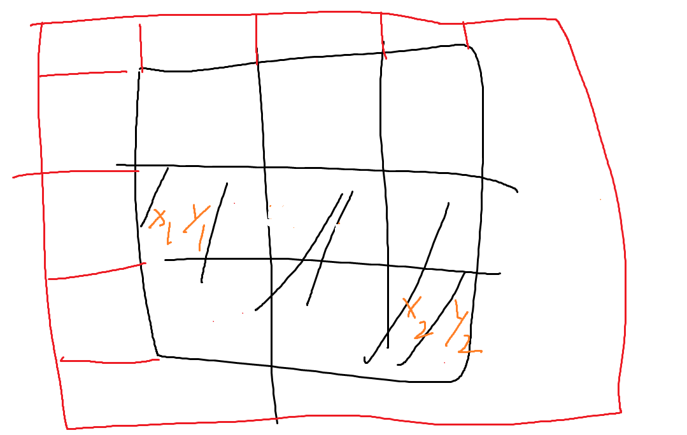
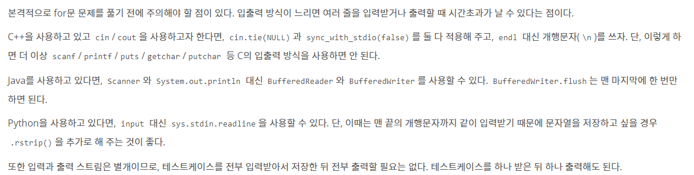

[백준11660](https://www.acmicpc.net/problem/11660)

### 23-03-27
```python
sq,cal=map(int,input().split())
cube=[]
for _ in range(sq):
    cube.append(list(map(int,input().split())))
for _ in range(cal):
    result=0
    x1,y1,x2,y2=map(int,input().split())
    result+=sum(cube[x1-1][y1-1:y2])
    for i in range(x1-1,x2):
        result+=cube[i][y2-1]
    print(result)

```
runtime error..
문제를 잘못 읽어서
(2,2)(3,4) 일때 3+4+5+6 인줄알았는데 그냥 해당 6칸 전체를 더하는 것이었음

```python
sq,cal=map(int,input().split())
cube=[]
for _ in range(sq):
    cube.append(list(map(int,input().split())))
for _ in range(cal):
    result=0
    x1,y1,x2,y2=map(int,input().split())
    for i in range(x1-1,x2):
        result+=sum(cube[i][y1-1:y2])
    print(result)
```
여전히 런타임에러. 중복 계산이 많아서 그런듯 한데... DP처럼 계산이 뭔가 자주 일어날때에 적용할 수 있던 것같은데..DP문제 하도 푼지 오래되서 기억이 가물가물

```python
sq,cal=map(int,input().split())
cube=[]
for _ in range(sq):
    cube.append(list(map(int,input().split())))
S=[]    
#구간합 구하기
for i in range(sq):
    temp=0
    templ=[]
    for j in range(sq):
        temp+=cube[i][j]
        templ.append(temp)
    S.append(templ)

for _ in range(cal):
    result=0
    x1,y1,x2,y2=map(int,input().split())
    for i in range(x1-1,x2):
        result+=(S[i][y2-1]-S[i][y1-1])
    print(result)
```
Still runtime...

심지어 답도 틀림..

일단 오늘은 스탑하고 머리 말짱할때로 미루기

### 2023-03-29

```python
sq,cal=map(int,input().split())
cube=[]
for _ in range(sq):
    cube.append(list(map(int,input().split())))
S=[[0 for _ in range(sq+1)] for _ in range(sq+1)]    
#구간합 구하기
#S[i-1]
temp=0
#첫줄
for i in range(1,sq+1):
    temp+=cube[0][i-1]
    S[1][i]=temp
#나머지
for i in range(2,sq+1):
    temp=0
    for j in range(1,sq+1):
        temp+=cube[i-1][j-1]
        S[i][j]=S[i-1][j]+temp
#구간합 잘나왔는지 확인
for i in S:
    print(i)
  
for _ in range(cal):
    x1,y1,x2,y2=map(int,input().split())
    print(S[x2][y2]-S[x2][y1-1]-S[x1-1][y2]+S[x1-1][y1-1])
```
구간합을 한줄하는게아니라 그냥 미리 전체를 구해두고 index로 서치시키는게 빠를거라해서 2d로 만들기로함
근데 처음에는 sq * sq 구간 array를 만드려했는데 나중에 빼는것생각했더니 Out of index 참조가 될게 뻔해서 조금 고민하다가 길이를 sq+1 * sq+1 로 만들기로 결정.



하지만 아직도 timeout
```python
sq,cal=map(int,input().split())
cube=[]
for _ in range(sq):
    cube.append(list(map(int,input().split())))
S=[[0 for _ in range(sq+1)] for _ in range(sq+1)]  
#구간합 구하기
#S[i-1]
#나머지
for i in range(1,sq+1):
    for j in range(1,sq+1):
        S[i][j]=S[i-1][j]+S[i][j-1]+cube[i-1][j-1]

for _ in range(cal):
    x1,y1,x2,y2=map(int,input().split())
    print(S[x2][y2]-S[x2][y1-1]-S[x1-1][y2]+S[x1-1][y1-1])
```
아하! 쓸데없이 temp를써서 계산을 더했나? 해서 수정했는데

출력 초과.

알고보니

    S[i][j]=S[i-1][j]+S[i][j-1]+cube[i-1][j-1]

이부분에서 중복계산(덧셈)이 들어가서 값이 이상해져버림

```python
sq,cal=map(int,input().split())
cube=[]
for _ in range(sq):
    cube.append(list(map(int,input().split())))
S=[[0 for _ in range(sq+1)] for _ in range(sq+1)]  

for i in range(1,sq+1):
    for j in range(1,sq+1):
        S[i][j]=S[i-1][j]+S[i][j-1]-S[i-1][j-1]+cube[i-1][j-1]

for _ in range(cal):
    x1,y1,x2,y2=map(int,input().split())
    print(S[x2][y2]-S[x2][y1-1]-S[x1-1][y2]+S[x1-1][y1-1])
```
바꾼코드가 이렇게됨 S[i-1][j-1]을 빼줌

근데도 시간초과가뜸. 아니 이거 말이 안되는데 O(n^2)보다 빠른 계산이 되나 싶은데

```python
import sys
input=sys.stdin.readline
sq,cal=map(int,input().split())
cube=[]
for _ in range(sq):
    cube.append(list(map(int,input().split())))
S=[[0 for _ in range(sq+1)] for _ in range(sq+1)]  

for i in range(1,sq+1):
    for j in range(1,sq+1):
        S[i][j]=S[i-1][j]+S[i][j-1]-S[i-1][j-1]+cube[i-1][j-1]

for _ in range(cal):
    x1,y1,x2,y2=map(int,input().split())
    print(S[x2][y2]-S[x2][y1-1]-S[x1-1][y2]+S[x1-1][y1-1])
```
그렇다.. input()이 시간을 너무 잡아먹어서 그런것이었다.
한동안 백준에서 문제 안풀고 프로그래머스에서만 풀어서 이것을 깜빡했었다...(허탈)

[입출력](https://www.acmicpc.net/problem/15552)

여기에 나와있는 것처럼 백준에서 입력을 뭐하려할때는 주의가 필요해보인다

